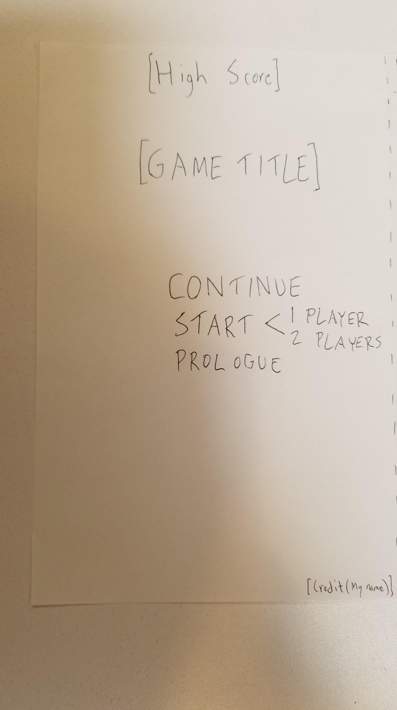
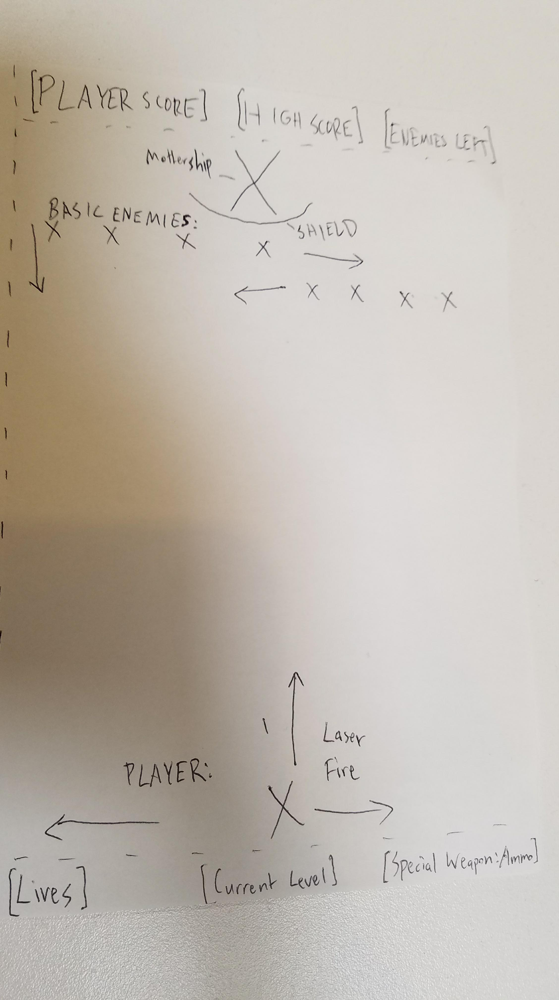

# space_clones

Original browser game inspired largely by the classic arcade game Space Invaders. Control a ship as you fight a brigade of alien ships.

## TECH USED

-- To make this game, I used HTML, CSS, Javascript, jQuery, along with audio and images borrowed from opengameart.org.

## PROBLEM I OVERCAME

-- The biggest issue I had by far was implementing a 2 Player mode. Setting up the basic logic wasn't terribly hard once I already had the logic written for 1 Player, but there were a lot of bugs that came out of it that I didn't expect. It took me quite a while to isolate the problems in my code and correct them.

## USER STORY

-- This will be a two player game, so first the user will be presented with a title screen displaying a high score at the top, with the option to play in a 1 player mode or 2 player mode. The 2 player mode will have the two players taking turns.

-- The player will control their ship using the left and right arrows or AD for directions, and either clicking or hitting spacebar to fire their laser. The player will be locked in a horizontal plane at the bottom of the game screen.

-- The player will begin the game with 3 lives. One hit will result in player death. Once all lives are depleted, the game will be over, and a final score screen will be presented with newly introduced fire accuracy + number of enemies defeated stats as well.

-- User will be able to see if they have beaten the high score and how many enemies are remaining before the level's mothership while playing.

-- Like in Space Invaders, each level will feature an array of descending enemy ships which will move left to right as they descend. Each enemy will disintegrate with one hit. Once all enemies are defeated, a mothership will appear that takes more hits to defeat.

-- As the player progresses, each level will increase the speed of the enemy ships, increasing the difficulty of the game.

-- Each defeated enemy ship will increment the player's score by a set value, with the mothership incrementing it by an increased amount.

## FUTURE POSSIBILITIES

-- Create bonus stages which allow the players to gain extra points, but player will not be able to die during these.

-- Implement a life bar rather than a one hit death.

-- Allow player to have x amount of continues upon a game over. Reset score/upgrades for each continue used.

-- Allow player to upgrade shields/weapons.

-- Allow player to customize the color of their ship.

-- Allow player to name their character.

-- Add a game demo if player leaves start menu open after a set interval of time.

-- Allow player to hold certain items and use them to their advantage at their discretion.

-- At higher levels, introduce meteors/comets/other space anomalies that will pose a threat to the player in addition to the enemy ships.

-- Create a final boss character that will result in a win for the player once defeated. The conflict between the final boss and the player is what drives the basic "plot" of the game.

## WIREFRAME

### Title Screen Wireframe

### Gameplay Wireframe

