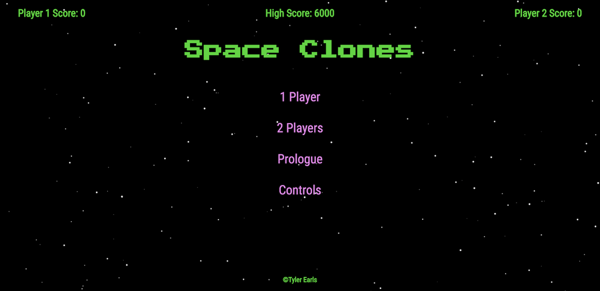
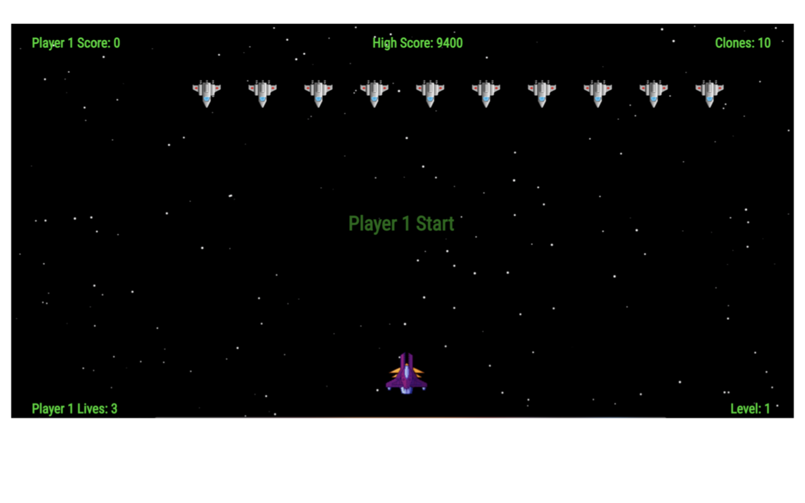
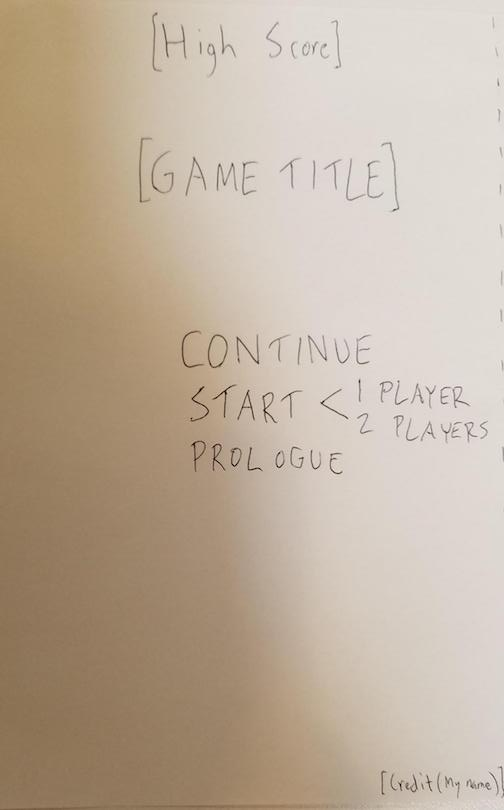
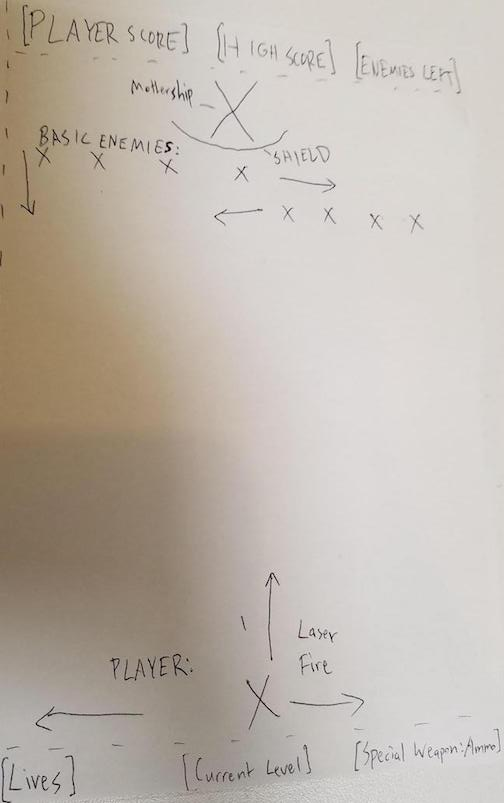

# Space Clones

Original web browser game built with JavaScript and jQuery, inspired by the classic arcade game, Space Invaders. Control a ship as you fight a brigade of alien clones hellbent on destroying Earth.

This project holds a special place in my heart because it's my first real code project that originated in my Web Development Immersive at General Assembly.

You can play [here.](https://tboneearls.github.io/space_clones/index.html)

## SCREENSHOTS

### Title Screen

### Gameplay

### End of Level

## WIREFRAMES

Don't judge me for my crappy hand drawings, lol. Like I said, this was my first project, so I didn't use modern prototyping tools. Keeping this for posterity.

### Title Screen Wireframe

### Gameplay Wireframe
