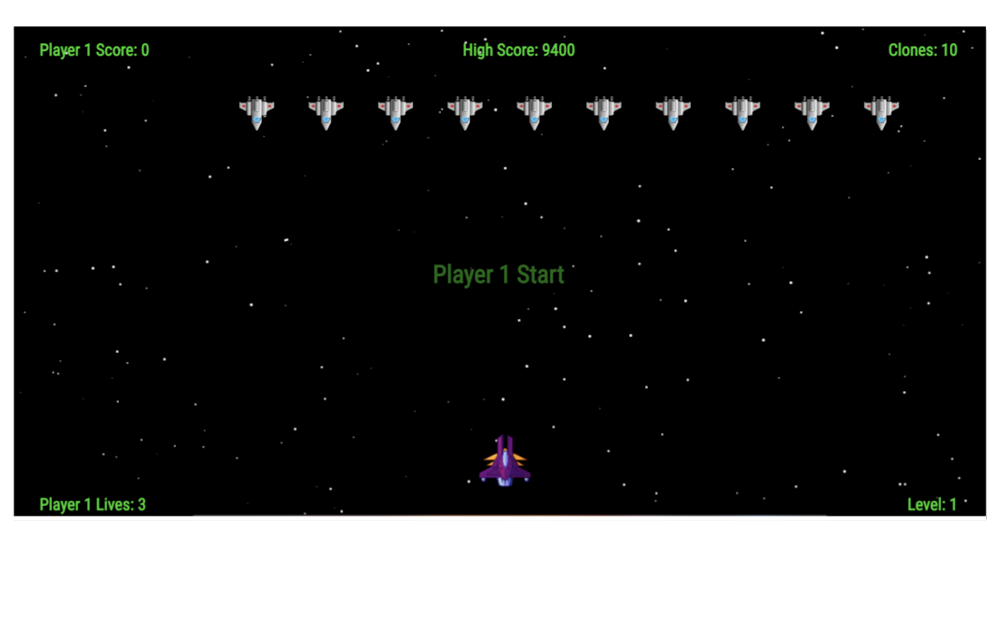
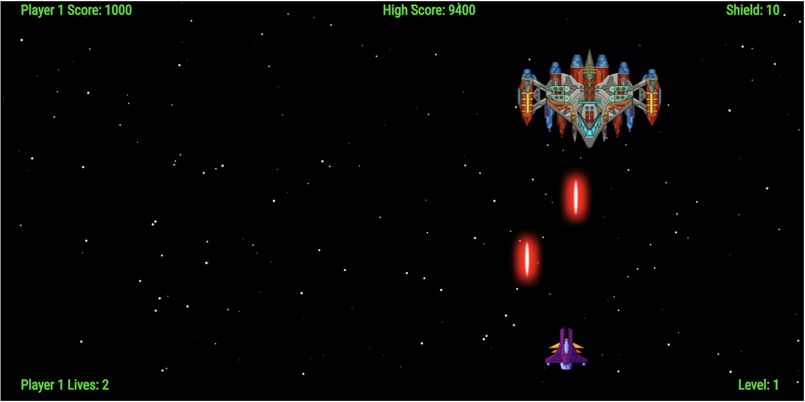

# Space Clones

Original web browser game built with JavaScript and jQuery, inspired by the classic arcade game, Space Invaders. Control a ship as you fight a brigade of alien clones hellbent on destroying Earth.

This project holds a special place in my heart, because it's my first real code project that originated in my Web Development Immersive at General Assembly.

You can play [here.](https://space-clones.netlify.com)

## SCREENSHOTS

### Title Screen

### Gameplay

### End of Level
